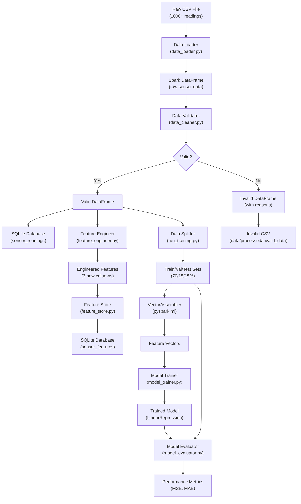

# Project Architecture

## High-Level System Architecture

This document explains how all the pieces of the project fit together.

### Architecture Diagram



## Architecture Explanation

The project follows a **pipeline architecture** where data flows through sequential processing stages, each transforming it further toward the goal.

### Stage 1: Data Loading
**File**: `src/data/data_loader.py`

**What happens**:
1. Spark reads CSV file with automatic schema inference
2. Column names are transformed to standard format:
   - `Timestamp` → `timestamp`
   - `Current Temperature (°C)` → `temperature`
   - `Humidity (%)` → `humidity`
3. Data types are converted:
   - Timestamp strings become datetime objects
   - Temperature and humidity become doubles (floating point)
4. Sensor ID is added (hardcoded as "MANUFACTURING_01")
5. Only required columns are selected

**Input**: Raw CSV file with 1000+ readings and many columns

**Output**: Spark DataFrame with standardized schema:
```
root
 |-- sensor_id: string
 |-- timestamp: timestamp
 |-- temperature: double
 |-- humidity: double
```

**Why this matters**: Standard column names and types make downstream processing reliable and predictable.

### Stage 2: Data Validation
**File**: `src/data/data_cleaner.py`

**What happens**:
1. Each record is checked against validation rules
2. Validation rules check for:
   - **Missing sensor_id**: sensor_id is null or empty
   - **Missing timestamp**: timestamp is null
   - **Missing temperature**: temperature is null
   - **Temperature out of range**: temperature < 300 or > 450
   - **Missing humidity**: humidity is null
   - **Humidity out of range**: humidity < 30 or > 80
3. All violation reasons are collected in an array
4. Empty reason array means valid record
5. DataFrame is split into two:
   - **valid_df**: Records with no violations
   - **invalid_df**: Records with violations (reasons included)

**Input**: DataFrame from Stage 1

**Output**: 
- `valid_df`: Clean data ready for processing
- `invalid_df`: Rejected data with reason strings

**Range definitions** (hardcoded):
```python
temperature_range = [300, 450]  # Celsius
humidity_range = [30, 80]       # Percentage
```

**Why this matters**: Separating valid/invalid data prevents bad data from corrupting analysis while preserving invalid records for debugging.

### Stage 3: Data Storage
**Files**: 
- `src/utils/database.py` (empty - database operations in run_training.py)
- `config/database.yaml` (configuration)

**What happens for VALID data**:
1. SQLite connection is established
2. `sensor_readings` table is created if it doesn't exist
3. Each valid record is inserted
4. INSERT OR IGNORE clause prevents duplicates
5. UNIQUE(sensor_id, timestamp) prevents same reading twice

**What happens for INVALID data**:
1. DataFrame is written to CSV with `mode="overwrite"`
2. Data is partitioned across multiple CSV files (Spark behavior)
3. CSV files stored in `data/processed/invalid_data/`
4. Rejection reasons included in each row

**SQLite schema for valid data**:
```sql
CREATE TABLE sensor_readings (
    id INTEGER PRIMARY KEY AUTOINCREMENT,
    sensor_id TEXT,
    timestamp TEXT,
    temperature REAL,
    humidity REAL,
    UNIQUE(sensor_id, timestamp)
)
```

**Why split**:
- Valid data goes to database for structured queries
- Invalid data stays in CSV for investigation
- Separation allows different retention policies

### Stage 4: Feature Engineering
**File**: `src/features/feature_engineer.py`

**What happens**:

#### Feature 1: Temperature Change
```python
previous_temp = lag("temperature", 1).over(window)
temperature_change = current_temp - previous_temp
```
- For each reading, gets temperature from previous reading
- Calculates change between them
- First reading has NULL (no previous value)
- Window is partitioned by sensor_id and ordered by timestamp

#### Feature 2: Rolling Average Temperature
```python
rolling_avg = avg("temperature").over(window)
```
- Calculates 30-minute rolling average
- Window looks back 30*60 seconds (30 minutes)
- Smooths out spikes and noise
- Used to capture trends

#### Feature 3: Target Variable
```python
target_temperature = lead("temperature", 12).over(window)
```
- Gets temperature 12 readings into future
- This is what we want to predict
- Last 12 readings have NULL (no future value)
- Used during model training as target label

**Input**: Valid sensor readings with timestamps

**Output**: DataFrame with 3 new columns added (original columns remain)

**Why these features**:
- **temperature_change**: Captures momentum (how fast temp is changing)
- **rolling_avg**: Captures trend (overall direction)
- **target_temperature**: Defines prediction target (what to forecast)

### Stage 5: Feature Storage
**File**: `src/features/feature_store.py`

**What happens**:
1. `sensor_features` table is created in SQLite
2. Each engineered feature row is inserted
3. INSERT OR IGNORE prevents duplicate features
4. UNIQUE(sensor_id, timestamp) key prevents re-inserting

**SQLite schema**:
```sql
CREATE TABLE sensor_features (
    id INTEGER PRIMARY KEY AUTOINCREMENT,
    sensor_id TEXT,
    timestamp TEXT,
    temperature REAL,
    humidity REAL,
    temperature_change REAL,
    rolling_avg_temperature REAL,
    UNIQUE(sensor_id, timestamp)
)
```

**Why persist features**:
- Features can be reused for multiple models
- Prevents recalculation of expensive transformations
- Enables batch predictions
- Supports analysis and debugging

### Stage 6: Data Splitting
**File**: `scripts/run_training.py` (lines 33-121)

**What happens**:
1. All data is ordered by timestamp (NOT random)
2. Row numbers are assigned in order
3. Total row count is calculated
4. Three splits are computed:
   - Train: rows 1 to 70%
   - Validation: rows 70% to 85%
   - Test: rows 85% to 100%

**Code pattern**:
```python
split_window = Window.orderBy("timestamp")
df = df.withColumn("row_num", row_number().over(split_window))
total = df.count()
train_end = int(total * 0.70)
val_end = train_end + int(total * 0.15)
```

**Proportions**:
- **Training set**: 70% (used to train model)
- **Validation set**: 15% (used to tune hyperparameters)
- **Test set**: 15% (held out for final evaluation)

**Why chronological split (not random)**:
Time-series data has temporal dependencies. Temperature at time T depends on temperature at time T-1. Random splitting would leak future information into training, giving false confidence.

**Example**:
```
If you have 1000 readings:
- Train: readings 1-700 (oldest to middle)
- Validation: readings 701-850 (middle to 85%)
- Test: readings 851-1000 (newest readings)
```

### Stage 7: Feature Vector Assembly
**File**: `scripts/run_training.py` (lines 96-103)

**What happens**:
1. VectorAssembler combines feature columns into single vector
2. Input columns: temperature, humidity, temperature_change, rolling_avg_temperature
3. Output column: "features" (vector of 4 numbers)

**Why needed**:
Spark ML models require features in vector format (not individual columns)

**Example transformation**:
```
Before: [20.5, 50.3, -2.1, 19.8]
        (individual columns)

After: DenseVector([20.5, 50.3, -2.1, 19.8])
       (single features vector)
```

### Stage 8: Model Training
**File**: `src/model/model_trainer.py`

**What happens**:
1. LinearRegression model is created
2. Model is trained on training data
3. Model learns relationship between:
   - **Input**: Features vector [temperature, humidity, temperature_change, rolling_avg_temperature]
   - **Output**: Target temperature (future temperature)

**Model parameters**:
```python
LinearRegression(
    featuresCol="features",
    labelCol="target_temperature",
    predictionCol="prediction"
)
```

**Outcome**:
- Trained model object that can predict future temperature
- Model coefficients (weights for each feature)
- Model intercept (base prediction)

**Why Linear Regression**:
- Simple and interpretable
- Good baseline for regression
- Fast training and inference
- Coefficients show feature importance

### Stage 9: Model Evaluation
**File**: `src/model/model_evaluator.py`

**What happens**:
1. Model makes predictions on validation data
2. Predictions compared against actual values
3. Two metrics are calculated:

**Mean Squared Error (MSE)**:
```
MSE = average((predicted - actual)²)
```
- Penalizes large errors more heavily
- Measured in °C²
- Lower is better

**Mean Absolute Error (MAE)**:
```
MAE = average(|predicted - actual|)
```
- Average magnitude of errors
- Measured in °C
- Lower is better

**Example**:
```
If actual temps are: [25, 30, 22]
Predicted temps:    [26, 29, 24]
Errors:             [1, 1, 2]

MSE = (1² + 1² + 2²) / 3 = 6/3 = 2.0 °C²
MAE = (|1| + |1| + |2|) / 3 = 4/3 = 1.33 °C
```

**Output**: 
- MSE value
- MAE value
- Average actual and predicted temperatures
- Correlation analysis (if implemented)

## System Data Flow

### How a Single Record Flows Through System

```
Example record from CSV:
  Timestamp: 2025-01-31 12:09:12
  Temperature: 368.73°C
  Humidity: 50.39%

↓ DATA LOADER
Raw columns transformed to standard names
Result: [MANUFACTURING_01, 2025-01-31 12:09:12, 368.73, 50.39]

↓ DATA VALIDATION
Temperature: 368.73 is in range [300, 450] ✓
Humidity: 50.39 is in range [30, 80] ✓
No null values ✓
Result: VALID

↓ DATABASE STORAGE
INSERT INTO sensor_readings VALUES (null, 'MANUFACTURING_01', '2025-01-31T12:09:12', 368.73, 50.39)
Stored in sensor_readings table

↓ FEATURE ENGINEERING
temperature_change = 368.73 - 367.5 = 1.23
rolling_avg_temperature = avg(past 30 minutes) = 368.0
target_temperature = look_ahead(12 readings) = 370.5

Result: Original columns + [1.23, 368.0, 370.5]

↓ FEATURE STORAGE
INSERT INTO sensor_features VALUES (null, 'MANUFACTURING_01', '2025-01-31T12:09:12', 
  368.73, 50.39, 1.23, 368.0)
Stored in sensor_features table

↓ DATA SPLIT ASSIGNMENT
Assigned to: Training set (if timestamp falls in first 70%)

↓ FEATURE VECTORIZATION
Features vector: [368.73, 50.39, 1.23, 368.0]
Target: 370.5

↓ MODEL TRAINING
Model learns: given features [368.73, 50.39, 1.23, 368.0], predict 370.5

↓ MODEL PREDICTION
Model predicts: 370.2 (close to actual 370.5)
Error: 0.3°C

↓ EVALUATION
Contributes to MSE and MAE metrics
```

## Component Communication

### How Components Connect

```
data_loader ──→ validates ──→ sensor_readings table
                                 ↓
                    ┌────────────┘
                    ↓
          feature_engineer ──→ feature_store ──→ sensor_features table
                    ↑
                    └──────────── data split
                              ↓
                         model_trainer
                              ↓
                        model_evaluator ──→ metrics (console output)
```

### Data Format Changes

```
Stage 1 (Raw CSV)
  ↓
  Spark DataFrame with columns

Stage 2 (Valid data)
  ↓
  Same Spark DataFrame (filtered)

Stage 3 (Features)
  ↓
  Spark DataFrame with 3 new columns

Stage 4 (Features with vectors)
  ↓
  Spark DataFrame with additional "features" vector column

Stage 5 (Predictions)
  ↓
  Spark DataFrame with "prediction" column added by model
```

## Configuration Dependencies

```yaml
# config/database.yaml
database:
  type: sqlite
  path: /path/to/sensor_data.db
  table: sensor_readings
    ↓
    ↓ (read by run_training.py)
    ↓
  sqlite3.connect(path)
    ↓
    ↓ (creates connection)
    ↓
  Database operations
```

## Key Architectural Decisions

| Decision | Implementation | Rationale |
|----------|---|---|
| **Distributed processing** | PySpark | Can scale to large data |
| **Separated storage** | Valid→DB, Invalid→CSV | Different use cases |
| **Chronological splitting** | order by timestamp | Time-series data properties |
| **Simple ML model** | LinearRegression | Good baseline, interpretable |
| **SQLite database** | File-based | No setup, sufficient scale |
| **Feature persistence** | sensor_features table | Enable feature reuse |

## Architectural Limitations

1. **Hardcoded paths**: File paths embedded in code, not in config
2. **Single sensor**: Only handles one manufacturing facility
3. **Monolithic script**: Everything in run_training.py, not modular
4. **No error boundaries**: Error in any stage stops entire pipeline
5. **No caching**: Features recalculated on every run
6. **No partial recovery**: Must restart from beginning if interrupted
7. **Synchronous only**: Linear execution, no parallelization between stages
8. **No model persistence**: Trained model discarded after evaluation

## Next Steps

- To see how files are organized, read [Complete Project Structure](./04-project-structure.md)
- To trace data movement, read [Data Flow](./08-data-flow.md)
- To understand specific components, read component documentation

---

**Key Takeaway**: The project follows a linear data pipeline architecture where each stage transforms data closer to the goal of accurate temperature prediction. Data splits between valid and invalid paths, and flows through PySpark for processing and SQLite for storage.
